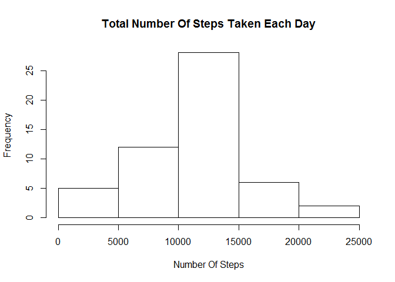

# Reproducible Research: Peer Assessment 1
## Loading and preprocessing the data
Loading following packages. If packages do not exist, install using install.packages().

```r
library("lubridate")
library("dplyr")
library("ggplot2")
```
Unzip and read activity file to activity

```r
unzip("activity.zip")
activity <- read.csv("activity.csv", header = TRUE)
```
## What is mean total number of steps taken per day?
Calculate mean, sum and median for steps taken each day

```r
steps.per.day <- activity %>% 
                 group_by(date) %>%
                 summarize(Mean=mean(steps, na.rm=TRUE), Total=sum(steps), Median=median(steps, na.rm=TRUE))

hist(steps.per.day$Total, main="Total Number Of Steps Taken Each Day", xlab="Number Of Steps")
```

\
Calculate mean and median for dataset.

```r
mean.steps.per.day <- as.integer(round(mean(steps.per.day$Total, na.rm=TRUE), digits = 0))
median.steps.per.day <- median(steps.per.day$Total, na.rm=TRUE)
```
Mean of total number of steps taken per day: 10766

Median of total number of steps taken per day: 10765

## What is the average daily activity pattern?
Calculate average steps taken during 5-minute interval and plot as time series

```r
daily.activity <- activity %>% 
                  group_by(interval) %>% 
                  summarise(Average=mean(steps, na.rm=TRUE))

max.steps.interval <- with(daily.activity, interval[Average==max(Average)])

plot(daily.activity, type="l", main="Average Number Of Steps Taken", ylab="Number Of Steps", xlab="Interval")

abline(v=max.steps.interval, lty=2, lwd=2)
```

\

Interval containing maximum number of steps: 835

## Imputing missing values

```r
NA.rows <- sum(is.na(activity))
```
Total number of missing values in dataset: 2304

Studying the activity dataset we see that there are 8 days missing data at all minute intervals. There are no days that are missing data for partial inverval set. Hence, the missing values in the original dataset will be replaced by average steps over entire dataset. We create new dataset as new.activity.

```r
new.value <- round(mean(activity$steps, na.rm=TRUE))
new.activity <- activity
new.activity$steps[is.na(new.activity$steps)] <- new.value
```

Calculate mean, sum and median for steps taken each day

```r
new.steps.per.day <- new.activity %>% 
                     group_by(date) %>%
                     summarize(Mean=mean(steps, na.rm=TRUE), Total=sum(steps), Median=median(steps, na.rm=TRUE))

hist(new.steps.per.day$Total, main="Total Number Of Steps Taken Each Day(Imputed)", xlab="Number Of Steps")
```

\

Calculate mean and median for new dataset.

```r
new.mean.steps.per.day <- as.integer(round(mean(new.steps.per.day$Total, na.rm=TRUE), digits = 0))
new.median.steps.per.day <- as.integer(median(new.steps.per.day$Total, na.rm=TRUE))
```
Mean of total number of steps taken per day for new dataset: 10752

Median of total number of steps taken per day for new dataset: 10656

Imputing missing values with average of dataset has resulted in difference between the mean and median of the dataset.

## Are there differences in activity patterns between weekdays and weekends?

Date columnn converted to date format using ymd()
Adding columns labelling date as Weekday or Weekend to new.activity dataset

```r
new.activity$date <- ymd(new.activity$date)
new.activity$Day.Type <- as.factor(ifelse(weekdays(new.activity$date) 
                                          %in% c("Saturday", "Sunday"),
                                          "Weekend", "Weekday"))
new.activity <- new.activity[, c("steps","date", "Day.Type", "interval")] 
```

Activity patterns between weekdays and weekends

```r
new.activity.plot <- new.activity %>%
                     group_by(Day.Type, interval) %>%
                     summarise(Mean.Steps = mean(steps))
qplot(interval, Mean.Steps, data=new.activity.plot, facets = Day.Type~., geom="path")
```

\

Comparing the time series plot, we can infer that activity trends between Weekdays and Weekends are different. Weekdays showing peaking activity early in the days whereas Weekends are compartively even throughout.
